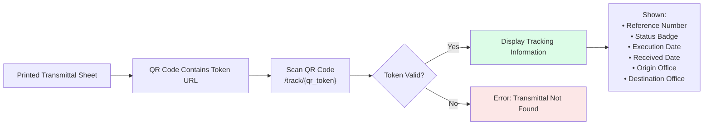

# DTI6-TMS — Process Workflow Documentation

**System:** DTI Region VI — Transmittal Management System  
**Date:** February 26, 2026

---

## Table of Contents

1. [Transmittal Lifecycle Overview](#1-transmittal-lifecycle-overview)
2. [Transmittal Creation Workflow](#2-transmittal-creation-workflow)
3. [Transmittal Receiving Workflow](#3-transmittal-receiving-workflow)
4. [Document Log Workflow (Division-to-Division)](#4-document-log-workflow-division-to-division)
5. [Public QR Tracking Workflow](#5-public-qr-tracking-workflow)
6. [Notification Workflow](#6-notification-workflow)
7. [Audit Trail Workflow](#7-audit-trail-workflow)
8. [Admin Management Workflows](#8-admin-management-workflows)

---

## 1. Transmittal Lifecycle Overview

---

## 2. Transmittal Creation Workflow

### Flowchart

### Step-by-Step

1. **Login**: User authenticates with email and password.
2. **Navigate**: Click "Create Transmittal" from the navigation menu.
3. **Auto-population**: Sender office is auto-filled from the user's office. Reference number is auto-generated as `T-{OFFICE_CODE}-{YEAR}-{SEQUENCE}`.
4. **Select Destination**: Choose the receiving office from a hierarchical dropdown (sender's own office is excluded).
5. **Set Date**: Defaults to today; can be changed.
6. **Add Items**: Dynamically add line items with quantity, unit, description, and optional remarks.
7. **Save**: Choose "Save as Draft" (editable later) or "Submit" (dispatched immediately).
8. **Audit**: Observer automatically creates an audit log entry.
9. **Notification**: If submitted, `NotificationService::notifyTransmittalCreated()` sends an in-app alert to all users in the receiving office.
10. **Print**: Generate and download a PDF with an embedded QR code for physical dispatch.

---

## 3. Transmittal Receiving Workflow

### Flowchart

### Step-by-Step

1. **Physical Receipt**: The receiving office gets the physical document bundle.
2. **QR Scan** (Option A): Scan the QR code → opens `/track/{qr_token}` public page → verify details → log into system.
3. **Manual Lookup** (Option B): Navigate to transmittal index → search by reference number.
4. **Policy Check**: System verifies the user belongs to the receiver office and has `receive transmittals` permission.
5. **Mark Received**: Click "Receive" → status changes to **Received**, `receiver_user_id` and `received_at` are recorded.
6. **Observer Audit**: `TransmittalObserver::updated()` creates audit log with "Received" action.
7. **Notification**: `NotificationService::notifyTransmittalReceived()` alerts the original sender.

---

## 4. Document Log Workflow (Division-to-Division)

### Flowchart

### Key Differences from Transmittal

| Aspect | Transmittal | Document Log |
|---|---|---|
| **Routing Level** | Office → Office | Division → Division (same office) |
| **Scope** | Cross-office (Regional ↔ Provincial) | Intra-office (ORD → BDD, etc.) |
| **Reference Format** | `T-{OFFICE}-{YEAR}-{SEQ}` | `DL-{OFFICE}-{YEAR}-{SEQ}` |
| **QR/PDF** | ✅ QR code + PDF generation | ❌ Not applicable |
| **Public Tracking** | ✅ `/track/{qr_token}` | ❌ Not applicable |
| **Audit Table** | `transmittal_logs` | `document_log_entries` |
| **Access Restriction** | Office-based | Division-based (within same office) |

---

## 5. Public QR Tracking Workflow

- **No authentication required** — accessible to anyone with the URL.
- **Rate limited**: `throttle:60,1` — maximum 60 requests per minute per IP address.
- **QR Token**: 12-character uppercase alphanumeric string (36¹² possible combinations).
- **Minimal data exposure**: Only shows reference, status, dates, and office names.

---

## 6. Notification Workflow

### Notification Scoping

Notifications are scoped by `office_id` **or** `user_id`. The `scopeForUser` query matches notifications where:
- `office_id` matches the user's office, OR
- `user_id` matches the user's ID

---

## 7. Audit Trail Workflow

### Key Properties
- **Immutable**: Log entries are created and never modified or deleted.
- **Automatic**: Observers are registered in `AppServiceProvider`, ensuring no event is missed.
- **Filterable**: Audit history can be filtered by date range, action type, office, and reference number.

---

## 8. Admin Management Workflows

### User Management

### Office Management

**Office Types**: Regional, Provincial, Negosyo Center, Attached  
**Hierarchy**: Offices support parent-child relationships via `parent_id` (e.g., Provincial → Regional).

### Division & Role Management

Similar CRUD workflows for divisions (Name, Code, Office) and roles (Name, Permissions).

---

_Document Version: 1.2 — Last Updated: February 26, 2026_
