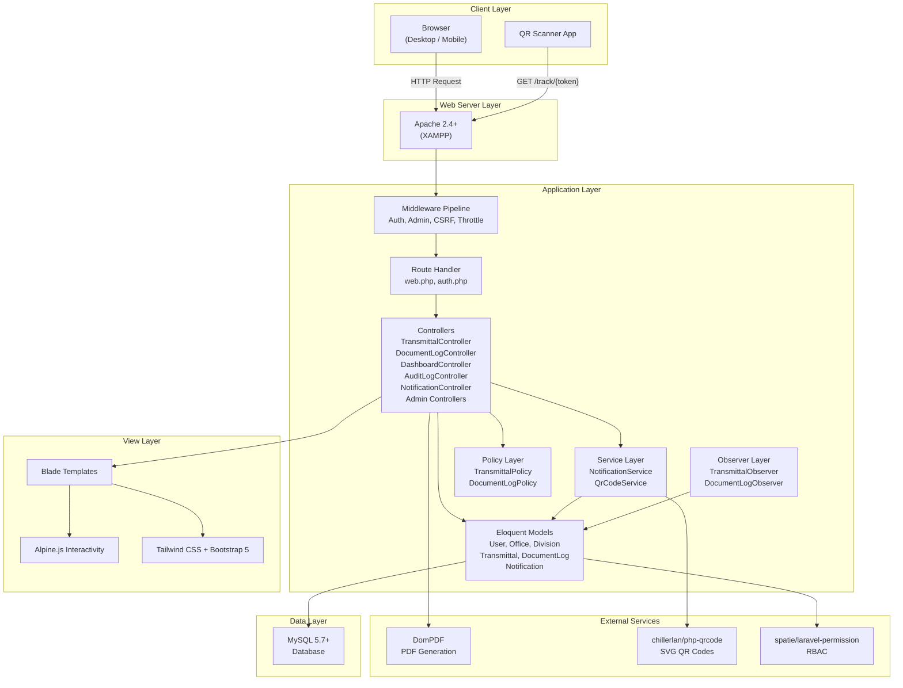
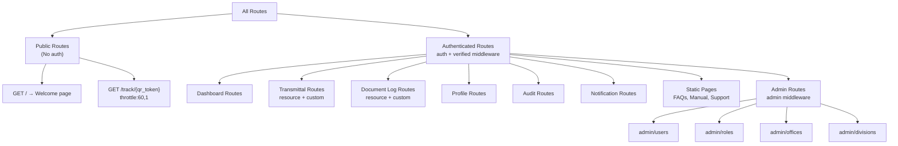
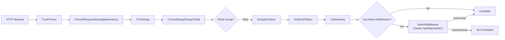
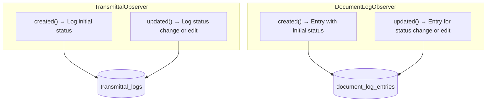
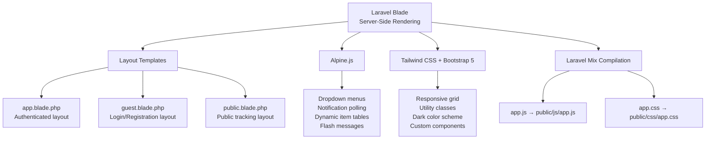
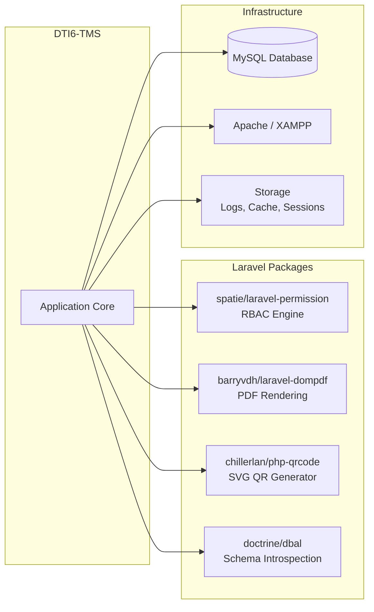

# DTI6-TMS — System Architecture

**System:** DTI Region VI — Transmittal Management System  
**Date:** February 26, 2026

---

## Table of Contents

1. [High-Level Architecture](#1-high-level-architecture)
2. [MVC Layer Breakdown](#2-mvc-layer-breakdown)
3. [Directory Structure](#3-directory-structure)
4. [Route Architecture](#4-route-architecture)
5. [Middleware Pipeline](#5-middleware-pipeline)
6. [Service Layer](#6-service-layer)
7. [Observer Pattern (Event-Driven)](#7-observer-pattern-event-driven)
8. [Policy Layer (Authorization)](#8-policy-layer-authorization)
9. [Frontend Architecture](#9-frontend-architecture)
10. [External Integrations](#10-external-integrations)

---

## 1. High-Level Architecture



---

## 2. MVC Layer Breakdown

### Models (10)

| Model | Table | Purpose | Key Relationships |
|---|---|---|---|
| `User` | `users` | System accounts & authentication | belongsTo Office, Division; hasMany sent/received Transmittals |
| `Office` | `offices` | Organizational units | hasMany Users, Divisions, sent/received Transmittals; self-referencing hierarchy |
| `Division` | `divisions` | Sub-organizational units | belongsTo Office; hasMany Users, sent/received DocumentLogs |
| `Transmittal` | `transmittals` | Office-to-office document bundles | belongsTo User (sender/receiver), Office (sender/receiver); hasMany Items, Logs |
| `TransmittalItem` | `transmittal_items` | Line items in a transmittal | belongsTo Transmittal |
| `TransmittalLog` | `transmittal_logs` | Audit trail entries | belongsTo Transmittal, User |
| `DocumentLog` | `document_logs` | Division-to-division internal routing | belongsTo Division (sender/receiver), User (sender/receiver), Office; hasMany Items, Entries |
| `DocumentLogItem` | `document_log_items` | Line items in a document log | belongsTo DocumentLog |
| `DocumentLogEntry` | `document_log_entries` | Audit trail for document logs | belongsTo DocumentLog, User |
| `Notification` | `notifications` | In-app user alerts | belongsTo User, Office |

### Controllers (11)

| Controller | Namespace | Routes | Purpose |
|---|---|---|---|
| `TransmittalController` | `App\Http\Controllers` | `transmittals.*` | Full CRUD + receive, PDF, QR track, item update |
| `DocumentLogController` | `App\Http\Controllers` | `document-logs.*` | Full CRUD + receive for division routing |
| `DashboardController` | `App\Http\Controllers` | `dashboard`, `dashboard.stats` | Dashboard view & AJAX stats |
| `AuditLogController` | `App\Http\Controllers` | `audit.*` | Audit history listing & detail view |
| `NotificationController` | `App\Http\Controllers` | `notifications.*` | Inbox, read/unread, delete, count |
| `ProfileController` | `App\Http\Controllers` | `profile.*` | User profile edit, update, delete |
| `UserController` | `App\Http\Controllers\Admin` | `admin.users.*` | Admin user CRUD |
| `RoleController` | `App\Http\Controllers\Admin` | `admin.roles.*` | Admin role/permission CRUD |
| `OfficeController` | `App\Http\Controllers\Admin` | `admin.offices.*` | Admin office CRUD |
| `DivisionController` | `App\Http\Controllers\Admin` | `admin.divisions.*` | Admin division CRUD |
| Auth Controllers (9) | `App\Http\Controllers\Auth` | `login`, `register`, etc. | Authentication lifecycle |

### Views

```
resources/views/
├── layouts/              → app.blade.php, guest.blade.php, navigation.blade.php, public.blade.php
├── components/           → 15 reusable Blade components
├── dashboard.blade.php   → Main dashboard
├── welcome.blade.php     → Landing / login page
├── transmittals/         → index, create, edit, show, pdf, public-track (6 views)
├── document-logs/        → index, create, edit, show (4 views)
├── admin/                → users/, offices/, divisions/, roles/ (14 views)
├── audit/                → index, show (2 views)
├── auth/                 → login, register, password reset (6 views)
├── notifications/        → index (1 view)
├── profile/              → edit + partials (4 views)
└── pages/                → faqs, manual, support (3 views)
```

---

## 3. Directory Structure

```
dti6-tms/
├── app/
│   ├── Console/               → Artisan command kernel
│   ├── Exceptions/            → Exception handler
│   ├── Http/
│   │   ├── Controllers/
│   │   │   ├── Admin/         → UserController, RoleController, OfficeController, DivisionController
│   │   │   ├── Auth/          → 9 authentication controllers (Laravel Breeze)
│   │   │   ├── TransmittalController.php
│   │   │   ├── DocumentLogController.php
│   │   │   ├── DashboardController.php
│   │   │   ├── AuditLogController.php
│   │   │   ├── NotificationController.php
│   │   │   └── ProfileController.php
│   │   ├── Middleware/        → AdminMiddleware, Authenticate, CSRF, etc. (9 files)
│   │   ├── Requests/         → StoreTransmittalRequest, UpdateTransmittalRequest, etc. (6 files)
│   │   └── Kernel.php        → Middleware registration
│   ├── Models/                → 10 Eloquent models
│   ├── Observers/             → TransmittalObserver, DocumentLogObserver
│   ├── Policies/              → TransmittalPolicy, DocumentLogPolicy
│   ├── Providers/             → AppServiceProvider, AuthServiceProvider, etc. (4 files)
│   ├── Services/              → NotificationService, QrCodeService
│   └── View/                  → 3 Blade components (View classes)
├── config/                    → 13 configuration files
├── database/
│   ├── factories/             → 3 model factories
│   ├── migrations/            → 16 migration files
│   └── seeders/               → 6 seeders (offices, roles, permissions, divisions, users)
├── public/                    → Front controller, compiled assets, images
├── resources/
│   ├── css/                   → app.css (Tailwind entry)
│   ├── js/                    → app.js, bootstrap.js
│   ├── lang/                  → Localization files
│   └── views/                 → 61 Blade template files
├── routes/
│   ├── web.php                → Primary routes (57 lines)
│   ├── auth.php               → Authentication routes
│   ├── api.php                → API routes (minimal)
│   └── console.php            → Console routes
├── storage/                   → Logs, cache, sessions
├── tests/                     → Feature & unit tests (15 files)
├── composer.json              → PHP dependencies
├── package.json               → Node.js dependencies
├── webpack.mix.js             → Laravel Mix asset config
└── tailwind.config.js         → Tailwind CSS configuration
```

---

## 4. Route Architecture

### Route Groups



### Route Count Summary

| Group | Route Count | Middleware |
|---|---|---|
| Public | 2 | none (+ throttle on tracking) |
| Dashboard | 2 | auth, verified |
| Transmittals | 8 | auth, verified |
| Document Logs | 8 | auth, verified |
| Profile | 3 | auth, verified |
| Audit | 2 | auth, verified |
| Notifications | 7 | auth, verified |
| Static Pages | 3 | auth, verified |
| Admin | 28 (4 resources × 7) | auth, verified, admin |
| Auth | ~10 | varies |
| **Total** | **~73** | |

---

## 5. Middleware Pipeline



### Custom Middleware

| Middleware | File | Purpose |
|---|---|---|
| `AdminMiddleware` | `app/Http/Middleware/AdminMiddleware.php` | Checks if user `hasRole('Admin')`, returns 403 if not |

---

## 6. Service Layer

### NotificationService

A static service class that centralizes all notification creation logic.

| Method | Trigger | Recipients |
|---|---|---|
| `notifyUser()` | Direct call | Single user |
| `notifyOffice()` | Internal | All users in an office |
| `notifyUsers()` | Internal | Multiple users by ID |
| `notifyTransmittalCreated()` | Transmittal submitted | All users in receiver office |
| `notifyTransmittalReceived()` | Transmittal received | Sender user |
| `notifyTransmittalStatusChanged()` | Status change | Sender user |
| `notifyDocumentLogCreated()` | Document log submitted | All users in receiver division |
| `notifyDocumentLogReceived()` | Document log received | Sender user |

### QrCodeService

Generates SVG QR codes using `chillerlan/php-qrcode`.

| Config | Value |
|---|---|
| Output Type | SVG (`OUTPUT_MARKUP_SVG`) |
| ECC Level | L (Low) |
| Scale | 5 |
| Transparent | No |

---

## 7. Observer Pattern (Event-Driven)



### Logged Actions

| Action | Trigger |
|---|---|
| `Draft` / `Submitted` | Model created with respective status |
| `Submitted` | Status changed from Draft → Submitted |
| `Received` | Status changed to Received |
| `Reverted to Draft` | Status changed from Submitted → Draft |
| `Edited` | Any field changed without status change |
| `Items Updated` | Manual log for transmittal item updates |

---

## 8. Policy Layer (Authorization)

### TransmittalPolicy

| Method | Admin | Creator | Office Member | Others |
|---|---|---|---|---|
| `viewAny` | ✅ (has permission) | ✅ | ✅ | ❌ |
| `view` | ✅ (all) | ✅ (own office) | ✅ (own office) | ❌ |
| `create` | ✅ | ✅ (has permission) | ✅ | ✅ |
| `update` | ✅ (all) | ✅ (not received) | ❌ | ❌ |
| `delete` | ✅ (all) | ✅ (not received) | ❌ | ❌ |
| `receive` | ✅ (submitted only) | ❌ | ✅ (receiver office, submitted only) | ❌ |

### DocumentLogPolicy

| Method | Admin | Creator | Division Member | Others |
|---|---|---|---|---|
| `viewAny` | ✅ | ✅ | ✅ | ❌ |
| `view` | ✅ | ✅ (own division) | ✅ (own division) | ❌ |
| `create` | ✅ | ✅ (needs division_id) | ✅ | ❌ |
| `update` | ✅ | ✅ (not received) | ❌ | ❌ |
| `delete` | ✅ | ✅ (not received) | ❌ | ❌ |
| `receive` | ✅ (submitted only) | ❌ | ✅ (receiver division, submitted only) | ❌ |

---

## 9. Frontend Architecture



### Asset Compilation Pipeline

```
resources/css/app.css → PostCSS → Tailwind → public/css/app.css
resources/js/app.js → Mix → public/js/app.js
```

---

## 10. External Integrations



---

_Document Version: 1.2 — Last Updated: February 26, 2026_
