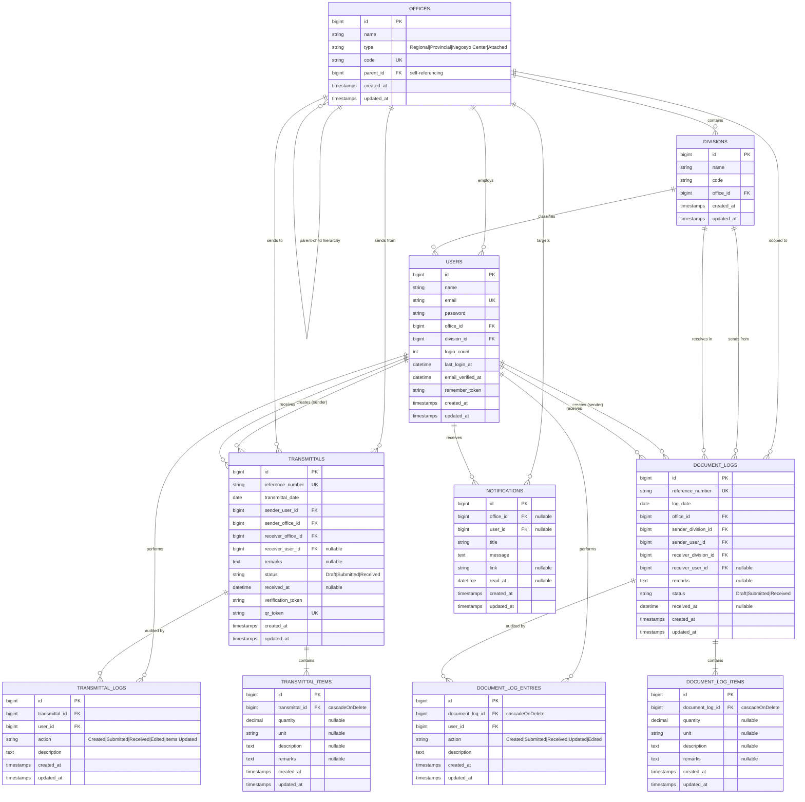

# DTI6-TMS — Database Documentation

**System:** DTI Region VI — Transmittal Management System  
**Date:** February 26, 2026

---

## Table of Contents

1. [Entity-Relationship Diagram](#1-entity-relationship-diagram)
2. [Table Reference](#2-table-reference)
3. [Relationships Map](#3-relationships-map)
4. [Indexes & Constraints](#4-indexes--constraints)
5. [Seeders & Default Data](#5-seeders--default-data)
6. [Migration History](#6-migration-history)

---

## 1. Entity-Relationship Diagram

---

## 2. Table Reference

### 2.1 `users`

| Column | Type | Nullable | Default | Description |
|---|---|---|---|---|
| `id` | bigint (PK) | No | auto | Primary key |
| `name` | varchar(255) | No | — | Full name |
| `email` | varchar(255) | No | — | Email (unique) |
| `email_verified_at` | timestamp | Yes | NULL | Email verification date |
| `password` | varchar(255) | No | — | Hashed password |
| `office_id` | bigint (FK → offices) | Yes | NULL | Assigned office |
| `division_id` | bigint (FK → divisions) | Yes | NULL | Assigned division |
| `login_count` | integer | No | 0 | Number of logins |
| `last_login_at` | timestamp | Yes | NULL | Last login datetime |
| `remember_token` | varchar(100) | Yes | NULL | Session token |
| `created_at` | timestamp | Yes | NULL | |
| `updated_at` | timestamp | Yes | NULL | |

### 2.2 `offices`

| Column | Type | Nullable | Default | Description |
|---|---|---|---|---|
| `id` | bigint (PK) | No | auto | Primary key |
| `name` | varchar(255) | No | — | Office full name |
| `type` | varchar(255) | No | — | Regional / Provincial / Negosyo Center / Attached |
| `code` | varchar(255) | No | — | Short code (unique) |
| `parent_id` | bigint (FK → offices) | Yes | NULL | Parent office for hierarchy |
| `created_at` | timestamp | Yes | NULL | |
| `updated_at` | timestamp | Yes | NULL | |

### 2.3 `divisions`

| Column | Type | Nullable | Default | Description |
|---|---|---|---|---|
| `id` | bigint (PK) | No | auto | Primary key |
| `name` | varchar(255) | No | — | Division name |
| `code` | varchar(255) | No | — | Short code |
| `office_id` | bigint (FK → offices) | No | — | Parent office |
| `created_at` | timestamp | Yes | NULL | |
| `updated_at` | timestamp | Yes | NULL | |

### 2.4 `transmittals`

| Column | Type | Nullable | Default | Description |
|---|---|---|---|---|
| `id` | bigint (PK) | No | auto | Primary key |
| `reference_number` | varchar(255) | No | — | Unique reference (T-OFFICE-YEAR-SEQ) |
| `transmittal_date` | date | No | — | Execution date |
| `sender_user_id` | bigint (FK → users) | No | — | Creator user |
| `sender_office_id` | bigint (FK → offices) | No | — | Sender office |
| `receiver_office_id` | bigint (FK → offices) | No | — | Destination office |
| `receiver_user_id` | bigint (FK → users) | Yes | NULL | Receiving user (set on receipt) |
| `remarks` | text | Yes | NULL | Optional notes |
| `status` | varchar(255) | No | Draft | Draft / Submitted / Received |
| `received_at` | timestamp | Yes | NULL | Receipt timestamp |
| `verification_token` | varchar(255) | Yes | NULL | 32-char random token |
| `qr_token` | varchar(255) | Yes | NULL | 12-char uppercase (unique) |
| `created_at` | timestamp | Yes | NULL | |
| `updated_at` | timestamp | Yes | NULL | |

### 2.5 `transmittal_items`

| Column | Type | Nullable | Default | Description |
|---|---|---|---|---|
| `id` | bigint (PK) | No | auto | Primary key |
| `transmittal_id` | bigint (FK → transmittals) | No | — | Parent transmittal (cascade delete) |
| `quantity` | decimal(10,2) | Yes | NULL | Item quantity |
| `unit` | varchar(255) | Yes | NULL | Unit of measure |
| `description` | text | Yes | NULL | Item description |
| `remarks` | text | Yes | NULL | Optional remarks |
| `created_at` | timestamp | Yes | NULL | |
| `updated_at` | timestamp | Yes | NULL | |

### 2.6 `transmittal_logs`

| Column | Type | Nullable | Default | Description |
|---|---|---|---|---|
| `id` | bigint (PK) | No | auto | Primary key |
| `transmittal_id` | bigint (FK → transmittals) | No | — | Related transmittal |
| `user_id` | bigint (FK → users) | No | — | User who performed action |
| `action` | varchar(255) | No | — | Action type |
| `description` | text | No | — | Detailed description |
| `created_at` | timestamp | Yes | NULL | |
| `updated_at` | timestamp | Yes | NULL | |

### 2.7 `document_logs`

| Column | Type | Nullable | Default | Description |
|---|---|---|---|---|
| `id` | bigint (PK) | No | auto | Primary key |
| `reference_number` | varchar(255) | No | — | Unique reference (DL-OFFICE-YEAR-SEQ) |
| `log_date` | date | No | — | Log date |
| `office_id` | bigint (FK → offices) | No | — | Scoping office |
| `sender_division_id` | bigint (FK → divisions) | No | — | Sender division |
| `sender_user_id` | bigint (FK → users) | No | — | Creator user |
| `receiver_division_id` | bigint (FK → divisions) | No | — | Recipient division |
| `receiver_user_id` | bigint (FK → users) | Yes | NULL | Receiving user (set on receipt) |
| `remarks` | text | Yes | NULL | Optional notes |
| `status` | varchar(255) | No | Draft | Draft / Submitted / Received |
| `received_at` | timestamp | Yes | NULL | Receipt timestamp |
| `created_at` | timestamp | Yes | NULL | |
| `updated_at` | timestamp | Yes | NULL | |

### 2.8 `document_log_items`

| Column | Type | Nullable | Default | Description |
|---|---|---|---|---|
| `id` | bigint (PK) | No | auto | Primary key |
| `document_log_id` | bigint (FK → document_logs) | No | — | Parent document log (cascade delete) |
| `quantity` | decimal(10,2) | Yes | NULL | Item quantity |
| `unit` | varchar(255) | Yes | NULL | Unit of measure |
| `description` | text | Yes | NULL | Item description |
| `remarks` | text | Yes | NULL | Optional remarks |
| `created_at` | timestamp | Yes | NULL | |
| `updated_at` | timestamp | Yes | NULL | |

### 2.9 `document_log_entries`

| Column | Type | Nullable | Default | Description |
|---|---|---|---|---|
| `id` | bigint (PK) | No | auto | Primary key |
| `document_log_id` | bigint (FK → document_logs) | No | — | Parent document log (cascade delete) |
| `user_id` | bigint (FK → users) | No | — | User who performed action |
| `action` | varchar(255) | No | — | Action type |
| `description` | text | No | — | Detailed description |
| `created_at` | timestamp | Yes | NULL | |
| `updated_at` | timestamp | Yes | NULL | |

### 2.10 `notifications`

| Column | Type | Nullable | Default | Description |
|---|---|---|---|---|
| `id` | bigint (PK) | No | auto | Primary key |
| `office_id` | bigint (FK → offices) | Yes | NULL | Target office |
| `user_id` | bigint (FK → users) | Yes | NULL | Target user |
| `title` | varchar(255) | No | — | Notification title |
| `message` | text | No | — | Notification body |
| `link` | varchar(255) | Yes | NULL | Action URL |
| `read_at` | timestamp | Yes | NULL | When read (NULL = unread) |
| `created_at` | timestamp | Yes | NULL | |
| `updated_at` | timestamp | Yes | NULL | |

### 2.11 Spatie Permission Tables

| Table | Columns | Purpose |
|---|---|---|
| `permissions` | id, name, guard_name, timestamps | Permission definitions |
| `roles` | id, name, guard_name, timestamps | Role definitions |
| `role_has_permissions` | permission_id, role_id | Role-permission assignments |
| `model_has_roles` | role_id, model_type, model_id | User-role assignments |
| `model_has_permissions` | permission_id, model_type, model_id | Direct user-permission assignments |

### 2.12 Framework Tables

| Table | Purpose |
|---|---|
| `password_resets` | Password reset tokens |
| `sessions` | Session storage (if using database driver) |
| `cache` | Cache storage |
| `cache_locks` | Cache lock management |
| `jobs` | Queue job storage |
| `job_batches` | Batch job tracking |
| `failed_jobs` | Failed queue job records |

---

## 3. Relationships Map

---

## 4. Indexes & Constraints

### Unique Constraints

| Table | Column(s) | Constraint |
|---|---|---|
| `users` | `email` | UNIQUE |
| `offices` | `code` | UNIQUE |
| `transmittals` | `reference_number` | UNIQUE |
| `transmittals` | `qr_token` | UNIQUE |
| `document_logs` | `reference_number` | UNIQUE |

### Foreign Key Constraints

| Table | Column | References | On Delete |
|---|---|---|---|
| `users` | `office_id` | `offices.id` | — |
| `users` | `division_id` | `divisions.id` | — |
| `divisions` | `office_id` | `offices.id` | — |
| `offices` | `parent_id` | `offices.id` | — |
| `transmittals` | `sender_user_id` | `users.id` | — |
| `transmittals` | `sender_office_id` | `offices.id` | — |
| `transmittals` | `receiver_office_id` | `offices.id` | — |
| `transmittals` | `receiver_user_id` | `users.id` | — |
| `transmittal_items` | `transmittal_id` | `transmittals.id` | CASCADE |
| `transmittal_logs` | `transmittal_id` | `transmittals.id` | — |
| `transmittal_logs` | `user_id` | `users.id` | — |
| `document_logs` | `office_id` | `offices.id` | — |
| `document_logs` | `sender_division_id` | `divisions.id` | — |
| `document_logs` | `sender_user_id` | `users.id` | — |
| `document_logs` | `receiver_division_id` | `divisions.id` | — |
| `document_logs` | `receiver_user_id` | `users.id` | — |
| `document_log_items` | `document_log_id` | `document_logs.id` | CASCADE |
| `document_log_entries` | `document_log_id` | `document_logs.id` | CASCADE |
| `document_log_entries` | `user_id` | `users.id` | — |
| `notifications` | `office_id` | `offices.id` | — |
| `notifications` | `user_id` | `users.id` | — |

---

## 5. Seeders & Default Data

### Execution Order (`DatabaseSeeder`)

1. `OfficeSeeder` — Creates RO6 + 6 provincial offices
2. `RolesAndPermissionsSeeder` — Creates 8 transmittal permissions + Admin/User roles
3. `DocumentLogPermissionSeeder` — Creates 5 document-log permissions, assigns to Admin/User
4. `DivisionSeeder` — Creates 5 RO6 divisions (ORD, BDD, CPD, FAD, IDD)
5. **Inline** — Creates Admin user (`admin@dti6.gov.ph`) and Default User (`user@dti6.gov.ph`)

### Seeded Data Summary

| Entity | Count | Details |
|---|---|---|
| Offices | 7 | 1 Regional + 6 Provincial |
| Divisions | 5 | All under RO6 |
| Roles | 2 | Admin, User |
| Permissions | 13 | 8 transmittal + 5 document-log |
| Users | 2 | Admin + Default User |

---

## 6. Migration History

| # | Migration | Tables/Changes |
|---|---|---|
| 1 | `0001_01_01_000000_create_users_table` | `users`, `password_resets`, `sessions` |
| 2 | `0001_01_01_000001_create_cache_table` | `cache`, `cache_locks` |
| 3 | `0001_01_01_000002_create_jobs_table` | `jobs`, `job_batches`, `failed_jobs` |
| 4 | `2026_01_04_130000_create_permission_tables` | Spatie permission tables (5 tables) |
| 5 | `2026_01_04_134648_create_offices_table` | `offices` |
| 6 | `2026_01_04_134648_create_transmittals_table` | `transmittals` |
| 7 | `2026_01_04_134649_add_role_and_office_to_users_table` | Add `office_id`, `login_count`, `last_login_at` to `users` |
| 8 | `2026_01_04_134650_create_transmittal_items_table` | `transmittal_items` |
| 9 | `2026_01_04_134651_create_transmittal_logs_table` | `transmittal_logs` |
| 10 | `2026_01_05_141455_create_notifications_table` | `notifications` |
| 11 | `2026_01_29_000000_create_divisions_table` | `divisions` |
| 12 | `2026_02_15_172537_make_transmittal_items_nullable` | Make quantity/unit/description/remarks nullable |
| 13 | `2026_02_18_015048_add_division_id_to_users_table` | Add `division_id` to `users` |
| 14 | `2026_02_18_015050_create_document_logs_table` | `document_logs` |
| 15 | `2026_02_18_015052_create_document_log_items_table` | `document_log_items` |
| 16 | `2026_02_18_015054_create_document_log_entries_table` | `document_log_entries` |

---

_Document Version: 1.2 — Last Updated: February 26, 2026_
