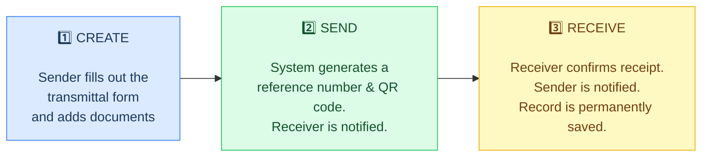

# DTI6 Transmittal Management System
## Presentation for the Process Owner

---

## Slide 1 — What Is This System?

### DTI6-TMS: Transmittal Management System

The **DTI6-TMS** is a web-based system that **replaces the old Microsoft Access** tool used for sending and tracking document transmittals.

| | Old Way | New System |
|---|---|---|
| 🖥️ **Access** | One computer only | Any browser, any device |
| 📍 **Tracking** | Manual follow-ups | Real-time status updates |
| 🔍 **Verification** | Phone calls / emails | Scan a QR code instantly |
| 📝 **Record-Keeping** | Prone to data loss | Automatic, permanent logs |

> **Goal:** Make sending, receiving, and tracking documents across DTI Region VI faster, more reliable, and fully traceable.

---

## Slide 2 — What Can It Do?

### Key Capabilities

| Feature | What It Does |
|---|---|
| 📦 **Send Documents** | Create a transmittal form, add items, and send it to any DTI office in the region |
| ✅ **Receive & Confirm** | The receiving office marks documents as received — the sender is notified instantly |
| 📱 **QR Code Tracking** | Every transmittal has a QR code. Scan it to see the status — no login needed |
| 📂 **Internal Routing** | Route documents between divisions within the same office (e.g., Finance → Admin) |
| 🔔 **Automatic Alerts** | Users are notified when documents arrive or are confirmed |
| 📊 **Dashboard** | See how many documents are pending, received, or in transit — at a glance |
| 📜 **Audit Trail** | Every action is permanently recorded — who did what, and when |

---

## Slide 3 — How Does It Work?

### Simple 3-Step Workflow

**Additional Highlights:**
- 🖨️ **Printable PDF** — Every transmittal can be printed with an embedded QR code
- 🔒 **Secure** — Only authorized personnel can send or receive for their office
- 🏢 **All Offices Covered** — Regional Office + 6 Provincial Offices pre-configured

---

## Slide 4 — Who Uses It & What's Next?

### Coverage

The system covers **all DTI Region VI offices**:

| Office Type | Offices |
|---|---|
| **Regional** | Regional Office VI (RO VI) |
| **Provincial** | Iloilo, Capiz, Aklan, Antique, Guimaras, Negros Occidental |

### User Roles

| Role | What They Can Do |
|---|---|
| **Staff** | Create, send, and receive transmittals for their assigned office |
| **Admin** | Full control — manage users, offices, and view all records region-wide |

### Status & Next Steps

✅ System is **built and ready for deployment**
✅ Full documentation is prepared (8 documents covering workflows, security, and user guides)
✅ Tested for mobile-friendly access

> **Next Step:** Deploy to the production server and begin onboarding users across all offices.

---

*DTI Region VI — Transmittal Management System (DTI6-TMS) • February 2026*
