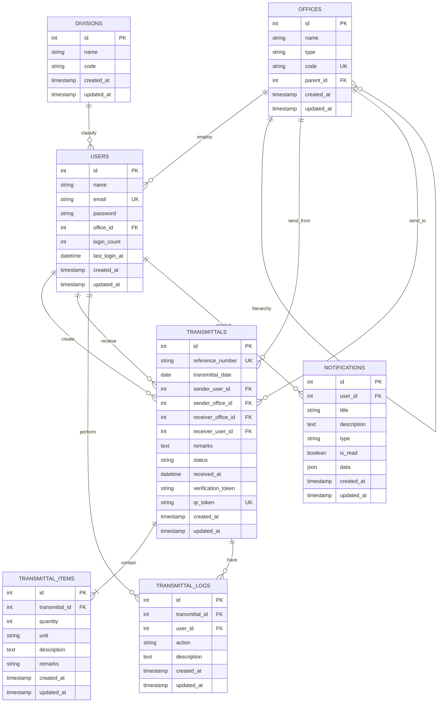
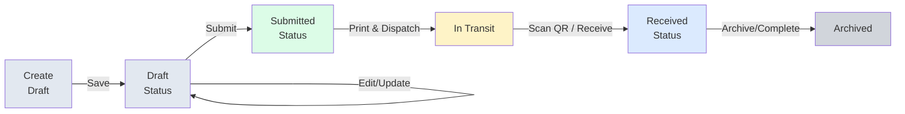
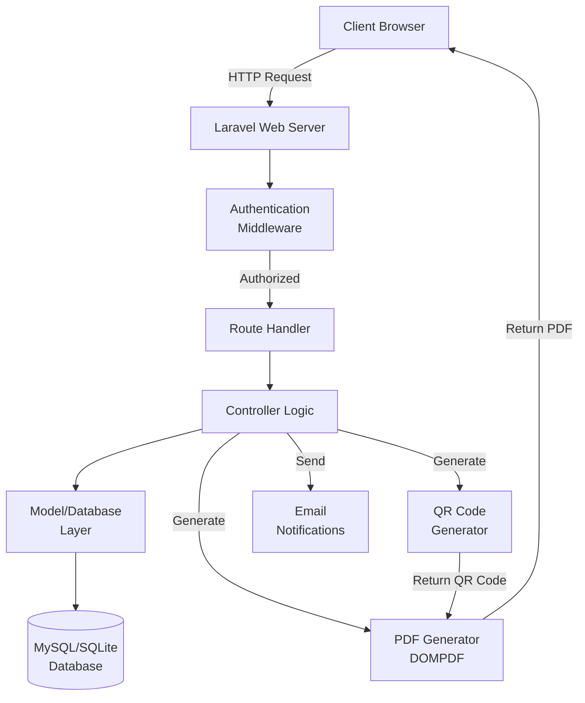

# DTI Region VI - Transmittal Management System (DTI6-TMS)

## System Development Documentation

**Prepared for:** DTI Region 6  
**Date:** January 29, 2026  
**Version:** 1.1

---

## Table of Contents

1. [Background](#background)
2. [Objectives](#objectives)
3. [System Outputs](#system-outputs)
4. [System Components](#system-components)
5. [Core Modules](#core-modules)
6. [Technology Stack](#technology-stack)
7. [System Database Design](#system-database-design)
8. [Workflow / User Flow](#workflow--user-flow)
9. [Annexes](#annexes)

---

## Background

The **DTI6 - Transmittal Management System (DTI6-TMS)** is a modern web-based platform designed to upgrade and replace the legacy Microsoft Access-based system. It serves as the central hub for the creation, routing, tracking, and archiving of official transmittal documents across all DTI Region VI offices. By migrating to a web architecture, the system ensures real-time accessibility, improved data integrity, and seamless collaboration between provincial and regional offices.

---

## Objectives

The system aims to:

- **Modernize Document Routing**: Replace offline/local network tools with a cloud-ready web application.
- **Enhance Traceability**: Provide real-time status updates and location tracking for every physical document bundle.
- **Improve Efficiency**: Simplify data entry with an Excel-like interface for transmittal items.
- **Ensure Accountability**: Implement comprehensive audit logs (`transmittal_logs`) to record every action (create, edit, receive).
- **Secure Verification**: Utilize QR Code technology to verify the authenticity of printed transmittal sheets.
- **Data-Driven Monitoring**: Deliver insights into office performance and document throughput via dashboards.

---

## System Outputs

- **Transmittal Sheets (PDF)**: Standardized, printable forms with embedded QR codes for physical routing.
- **Audit History Logs**: Detailed history of document movements and user actions.
- **Office Analytics**: Statistical reports on transmittal volume per office.
- **Real-time Notifications**: Alerts for incoming documents or status changes.

---

## System Components

### User Roles & Access

**Super Admin / Regional MIS**

- Full control over system configurations, users, and offices.
- Management of Roles and Permissions via the Spatie Laravel Permission package.
- Access to global audit logs and system-wide reports.
- Administrative access to user management, role management, office management, and division management.
- View all transmittals across all offices without restrictions.

**Regular User (Office Staff)**

- **Transmittal Creator**: Ability to draft, create, and print transmittals with embedded QR codes.
- **Receiver**: Ability to mark incoming transmittals as "Received" using QR scan or manual tracking number lookup.
- **Viewer**: Access to personal and office-specific transaction history and audit logs.
- Office-restricted view: Users can only see transmittals associated with their office (as sender or receiver).

### Organizational Structure

- **Offices**: The system categorizes users into specific DTI Offices (Regional, Provincial, Negosyo Centers, Attached units), ensuring transmittals are correctly routed and viewable based on user authority and office associations.
- **Divisions**: Optional organizational sub-units for further categorization (implemented via the `divisions` table).
- **Hierarchical Office Structure**: Offices can have parent-child relationships for organizational hierarchy representation.

### Authentication & User Management

- Built-in Laravel authentication system with email verification support.
- User login tracking with `login_count` and `last_login_at` fields for audit purposes.
- Password reset and profile management capabilities.
- User creation, editing, and deletion restricted to Super Admin and Regional MIS roles.

---

## Core Modules

### 1. Transmittal Management

- **Creation Wizard**: Single-page form with dynamic item management. Users enter:
  - Transmittal date (defaults to today)
  - Sender office (auto-populated from user's office)
  - Receiver/destination office (dropdown selection, excludes sender's office)
  - Multiple line items with quantity, unit, description, and remarks
  
- **Reference Number Generation**: Automatic sequential numbering format `T-OFFICE-YEAR-SEQUENCE` based on:
  - Office code of the sender
  - Current year
  - Sequential counter for transmittals from that office in the year

- **Transmittal Status Lifecycle**:
  - **Draft**: Initial state when created
  - **Submitted**: After finalizing and marking as ready for dispatch
  - **Received**: After being scanned/received by the destination office
  
- **Item Management**: 
  - Dynamic table interface for adding/removing line items
  - Each item tracks: quantity, unit, description, and remarks
  - Supports multiple items per transmittal (cascade delete on transmittal deletion)

- **PDF Generation**: On-demand generation using `barryvdh/laravel-dompdf` with:
  - Professional formatting
  - Embedded QR code for unique identification
  - Automatic paper size and layout optimization
  - Print-friendly styling

- **QR Code Integration**: 
  - Automatic QR token generation on transmittal creation (12-character uppercase string)
  - Unique QR token per transmittal for verification
  - QR token used in public tracking URLs for secure verification without authentication
  - Public tracking route: `/track/{qr_token}` accessible without authentication

- **Receiving Module**: 
  - Dedicated interface to accept incoming transmittals
  - Two methods of lookup: QR code scanning or manual reference number search
  - Automatic status update to "Received" upon acceptance
  - Records receiver user and timestamp of receipt
  - Creates audit log entry for the receive action

- **Transmittal Filtering & Search**:
  - Advanced filtering by status, office, date range
  - Full-text search by reference number
  - Default view filters to current date for quick access
  - Date range filtering (from date and to date)
  - Office-based access control for non-admin users

### 2. Public Tracking Feature

- **QR Code Public Tracking**: Anonymous tracking via unique QR tokens
  - Accessible at `/track/{qr_token}` without authentication
  - Modern receipt-style UI with clean card design
  - Displays transmittal status, dates, origin, and destination
  - No navigation menu for public-facing pages
  - Single-column layout for clarity
  
- **Tracking Information Display**:
  - Transmittal reference number with status badge
  - Execution date (transmittal_date)
  - Received date and time (if received)
  - Origin office (sender) with code and name
  - Destination office (receiver) with code and name
  - Security notice about link privacy

- **Status Badge Styling**:
  - Received: Green gradient background
  - Submitted: Blue gradient background
  - Draft: Gray gradient background

### 3. Office & User Administration

- **User Management** (Super Admin only):
  - CRUD operations for system accounts
  - User assignment to offices
  - Role assignment and management
  - Login tracking and history
  
- **Office Management** (Super Admin only):
  - Complete office/unit management
  - Office type classification (Regional, Provincial, Negosyo Center, Attached)
  - Office code management (unique identifier)
  - Hierarchical office structure support (parent_id field)
  - Office listing with view, edit, delete capabilities
  
- **Division Management** (Super Admin only):
  - Create and manage organizational divisions
  - CRUD operations for divisions
  - Support for sub-organizational categorization
  
- **Role & Permission Management** (Super Admin only):
  - Role-Based Access Control (RBAC) powered by `spatie/laravel-permission`
  - Create, edit, delete roles
  - Assign permissions to roles
  - Default roles: "Super Admin", "Regional MIS", standard users

### 4. Dashboard & Analytics

- **Activity Overview**: 
  - Summary dashboard showing pending, received, and outgoing transmittals
  - Quick statistics on transmittal volume
  - Real-time stats via AJAX endpoint (`/dashboard/stats`)
  
- **Performance Metrics**:
  - Volume of transactions processed per office
  - Date-based filtering for trend analysis
  - User-specific and office-specific views

### 5. Notifications & Logs

- **Audit Logs** (`transmittal_logs`):
  - Immutable record of who did what and when
  - Logged actions: Created, Submitted, Received, Edited
  - User tracking for accountability
  - Detailed description of actions
  - Audit history viewable by authorized users with filtering capabilities
  
- **In-App Notifications** (`notifications` table):
  - System-generated alerts for transmittal events
  - User notification inbox
  - Mark notifications as read functionality
  - Unread count display in UI
  - Supports email and in-app delivery (extensible)

### 6. User Utilities

- **Profile Management**:
  - Users can edit their own profile information
  - Password change capability
  - Account deletion option
  
- **FAQs Page**: 
  - Static page with frequently asked questions
  - Accessible to all authenticated users
  
- **User Manual**: 
  - System usage documentation
  - Available to all authenticated users
  
- **Support Page**: 
  - Support information and contact details
  - Accessible to all authenticated users

---

## Technology Stack

### Backend

- **Framework**: Laravel 8.x
- **Language**: PHP 7.4
- **Database**: MySQL / SQLite
- **Server**: Apache (XAMPP)

### Frontend

- **Framework**: Blade Templates
- **Styling**: Bootstrap 5 & Tailwind CSS
- **Icons**: Bootstrap Icons (Localized)
- **Scripting**: Alpine.js (Localized)
- **Asset Manager**: Laravel Mix (NPM Managed)

### Key Libraries

- **PDF Generation**: `barryvdh/laravel-dompdf`
- **QR Codes**: `chillerlan/php-qrcode`
- **Permissions**: `spatie/laravel-permission`

---

## System Database Design

### Main Tables

#### **users**
- System accounts with authentication
- Fields: id, name, email, password, office_id, login_count, last_login_at, timestamps
- Relations: belongsTo Office, hasMany Transmittals (as sender), hasMany Transmittals (as receiver)
- Uses Spatie Permission traits for role management

#### **offices**
- Definition of organizational units (e.g., "Ord - Admin", "Iloilo Provincial Office")
- Fields: id, name, type (Regional/Provincial/Negosyo Center/Attached), code (unique), parent_id (for hierarchy), timestamps
- Types: Regional, Provincial, Negosyo Centers, Attached units
- Supports hierarchical structure via parent_id field

#### **divisions**
- Optional organizational sub-units
- Fields: id, name, code, timestamps
- Enables further categorization beyond offices

#### **transmittals**
- Header record for a document bundle
- Fields: id, reference_number (unique), transmittal_date, sender_user_id, sender_office_id, receiver_office_id, receiver_user_id, remarks, status (Draft/Submitted/Received), received_at, verification_token, qr_token, timestamps
- Status values: Draft, Submitted, Received
- Automatic QR token generation on creation (12-char uppercase)
- Verification token for document integrity
- Relations: belongsTo User (sender/receiver), belongsTo Office (sender/receiver), hasMany TransmittalItems, hasMany TransmittalLogs

#### **transmittal_items**
- Individual line items contained within a transmittal
- Fields: id, transmittal_id, quantity, unit, description, remarks, timestamps
- Cascading delete when transmittal is deleted
- Relations: belongsTo Transmittal

#### **transmittal_logs**
- Historical audit trail of transmittal events
- Fields: id, transmittal_id, user_id, action (Created/Submitted/Received/Edited), description, timestamps
- Immutable record for accountability and compliance
- Relations: belongsTo Transmittal, belongsTo User

#### **notifications**
- User alert system
- Fields: id, user_id, title, description, type, is_read, data (JSON), timestamps
- Supports multiple notification types
- Mark as read functionality
- Relations: belongsTo User

#### **permissions** (Spatie)
- Permission definitions for role-based access
- Fields: id, name, guard_name, timestamps

#### **roles** (Spatie)
- Role definitions
- Fields: id, name, guard_name, timestamps
- Default roles: Super Admin, Regional MIS, Standard User

#### **role_has_permissions** (Spatie)
- Junction table for role-permission relationships
- Fields: permission_id, role_id

#### **model_has_roles** (Spatie)
- Junction table for user-role assignments
- Fields: role_id, model_id, model_type

#### **cache** & **jobs**
- Framework-level tables for Laravel caching and queue management

---

## API Endpoints & Routes

### Public Routes (No Authentication Required)

- `GET /` - Welcome/home page
- `GET /track/{qr_token}` - Public transmittal tracking via QR token

### Authenticated Routes (Require Login)

#### Dashboard
- `GET /dashboard` - Main dashboard view
- `GET /dashboard/stats` - Real-time statistics (AJAX)

#### Transmittal Management
- `GET /transmittals` - List all accessible transmittals (with filtering)
- `GET /transmittals/create` - Create transmittal form
- `POST /transmittals` - Store new transmittal
- `GET /transmittals/{id}` - View transmittal details
- `GET /transmittals/{id}/edit` - Edit transmittal form
- `PATCH /transmittals/{id}` - Update transmittal
- `DELETE /transmittals/{id}` - Delete transmittal
- `PATCH /transmittals/{id}/receive` - Mark transmittal as received
- `POST /transmittals/{id}/update-items` - Update transmittal items
- `GET /transmittals/{id}/pdf` - Download transmittal as PDF

#### Audit & History
- `GET /audit-history` - View audit logs
- `GET /audit-history/{id}` - View specific audit log entry

#### Notifications
- `GET /notifications` - View notification inbox
- `GET /notifications/unread-count` - Get unread count (AJAX)
- `POST /notifications/{id}/read` - Mark notification as read

#### User Profile
- `GET /profile` - Edit profile form
- `PATCH /profile` - Update profile
- `DELETE /profile` - Delete account

#### Information Pages
- `GET /faqs` - Frequently asked questions
- `GET /user-manual` - System user manual
- `GET /support` - Support information

### Admin Routes (Super Admin/Regional MIS Only)
Prefix: `/admin/` with middleware: `admin`

#### User Management
- `GET /admin/users` - List users
- `GET /admin/users/create` - Create user form
- `POST /admin/users` - Store new user
- `GET /admin/users/{id}` - View user details
- `GET /admin/users/{id}/edit` - Edit user form
- `PATCH /admin/users/{id}` - Update user
- `DELETE /admin/users/{id}` - Delete user

#### Role Management
- `GET /admin/roles` - List roles
- `GET /admin/roles/create` - Create role form
- `POST /admin/roles` - Store new role
- `GET /admin/roles/{id}` - View role details
- `GET /admin/roles/{id}/edit` - Edit role form
- `PATCH /admin/roles/{id}` - Update role
- `DELETE /admin/roles/{id}` - Delete role

#### Office Management
- `GET /admin/offices` - List offices
- `GET /admin/offices/create` - Create office form
- `POST /admin/offices` - Store new office
- `GET /admin/offices/{id}` - View office details
- `GET /admin/offices/{id}/edit` - Edit office form
- `PATCH /admin/offices/{id}` - Update office
- `DELETE /admin/offices/{id}` - Delete office

#### Division Management
- `GET /admin/divisions` - List divisions
- `GET /admin/divisions/create` - Create division form
- `POST /admin/divisions` - Store new division
- `GET /admin/divisions/{id}` - View division details
- `GET /admin/divisions/{id}/edit` - Edit division form
- `PATCH /admin/divisions/{id}` - Update division
- `DELETE /admin/divisions/{id}` - Delete division

---

## Workflow / User Flow

### 1. Transmittal Creation Workflow (Sender)

1. **Authenticate**: User logs in with credentials
2. **Navigate**: Access "Create Transmittal" from main menu
3. **Setup**: 
   - System auto-fills sender office from user's office
   - System auto-generates reference number based on office code and year
4. **Define Details**:
   - Select destination office (receiver_office_id)
   - Set transmittal date (defaults to today)
   - Enter remarks (optional)
5. **Add Items**: Dynamically add line items to the transmittal:
   - Item quantity and unit
   - Item description
   - Item remarks (optional)
6. **Save**: Save the transmittal in "Draft" status
   - System creates audit log entry "Created"
   - QR token generated automatically
7. **Finalize**: Mark transmittal as "Submitted" (ready for dispatch)
   - Status changes from Draft to Submitted
   - Audit log entry "Submitted" recorded
8. **Print**: Generate and print PDF with embedded QR code
   - PDF contains all transmittal details and QR code
   - Ready for physical dispatch

### 2. Receiving Process (Receiver)

**Option A: QR Code Scan**
1. Receiver gets physical bundle with printed transmittal sheet
2. Scans QR code using device camera or QR scanner app
3. System redirects to `/track/{qr_token}` (public tracking page)
4. Can verify details and access full system if authenticated

**Option B: Manual Reference Number Lookup**
1. Receiver navigates to "Receive Transmittal" section
2. Enters or searches for reference number
3. Locates the transmittal in the system
4. Clicks "Receive" button

**Receiving Completion**:
1. System updates transmittal status to "Received"
2. Records receiver user ID and timestamp (received_at)
3. Creates audit log entry "Received"
4. System generates notification for sender
5. Transmittal lifecycle completes

### 3. Public Tracking (No Authentication)

1. **QR Code Generation**: When transmittal is printed, QR code contains unique token
2. **Public Access**: Anyone with the QR code can scan to access `/track/{qr_token}`
3. **View Information** (no login required):
   - Transmittal reference number
   - Transmittal status (Draft/Submitted/Received)
   - Execution date
   - Received date and time (if applicable)
   - Origin office (sender details)
   - Destination office (receiver details)
4. **Security**: URL token is unique and difficult to guess; only displays basic tracking info

### 4. Audit & Tracking (Authenticated Users)

1. **Access Audit History**: Authorized users navigate to "Audit History"
2. **View Transmittal Timeline**: Complete lifecycle is displayed:
   - Created by User X at timestamp
   - Submitted at timestamp
   - Received by User Y at timestamp
3. **Filter & Search**:
   - Filter by date range
   - Search by reference number
   - Filter by action type
   - View detailed descriptions of each action
4. **Export/Report**: Can use audit history for compliance and reporting

### 5. User & Role Management (Super Admin Only)

1. **Access Admin Panel**: Navigate to admin section
2. **User Management**:
   - Create new user with office assignment
   - Edit user details and office associations
   - Assign roles to users
   - Delete users and their associations
   - Track user login history
3. **Role Management**:
   - Create custom roles
   - Assign permissions to roles
   - Edit and delete roles
   - Manage default roles (Super Admin, Regional MIS)
4. **Office Management**:
   - Create new offices with type classification
   - Set office codes and names
   - Define office hierarchy (parent_id)
   - Manage all organizational units
5. **Division Management**:
   - Create sub-organizational units
   - Manage division codes and names
   - Organize staff by divisions

### 6. Dashboard & Analytics

1. **Access Dashboard**: Authenticated user logs in
2. **View Overview**:
   - Quick stats on pending transmittals
   - Received transmittals count
   - Outgoing transmittals
   - Recent activity timeline
3. **Filter Data**: Use date range and office filters
4. **Real-time Updates**: Dashboard stats auto-refresh via AJAX

---

## Recent Enhancements (Version 1.1)

### Public Transmittal Tracking Feature
- **Implemented**: Modern receipt-style tracking page accessible via QR token
- **URL**: `/track/{qr_token}` (no authentication required)
- **Features**:
  - Clean, minimalist card-based UI design
  - Displays transmittal reference, status, dates, and location information
  - No navigation menu for public-facing pages
  - Single-column layout for clarity
  - Responsive design for mobile devices
  - Modern gradient styling for status badges
  - Professional layout optimized for printing

### QR Token Implementation
- Automatic unique QR token generation (12-character uppercase alphanumeric)
- QR token stored in `transmittals.qr_token` column
- Secure verification without requiring authentication
- Integrated into PDF printing for quick public access

---

## System Features & Capabilities

### Security & Access Control

- **Role-Based Access Control (RBAC)**: Implemented via Spatie Laravel Permission
- **Office-Based Filtering**: Users see only transmittals related to their office
- **User Authentication**: Laravel built-in authentication with email verification
- **Audit Trail**: Complete audit log of all system actions
- **Login Tracking**: Track user login history and frequency
- **QR Token Verification**: Secure public tracking without user credentials

### Data Integrity

- **Cascading Deletes**: Related records cleaned up when transmittal deleted
- **Foreign Key Constraints**: Referential integrity enforced at database level
- **Unique Constraints**: Reference numbers and office codes unique
- **Timestamp Tracking**: All records track creation and modification times
- **Immutable Audit Logs**: Audit entries created but never modified

### Performance Optimizations

- **Pagination**: Transmittal lists paginated for efficient loading (5 per page)
- **Query Optimization**: Eager loading with relationships (with clause)
- **AJAX Updates**: Real-time statistics without page reloads
- **Efficient Filtering**: Database-level filtering for large datasets

### User Experience

- **Auto-generated Reference Numbers**: Eliminates manual entry errors
- **Dynamic Item Management**: Add/remove transmittal items without page refresh
- **Instant PDF Generation**: Print-ready documents on demand
- **Real-time Notifications**: Users alerted of important events
- **Office Hierarchy**: Intuitive organizational structure representation
- **Search & Filter**: Advanced filtering capabilities for transmittals
- **Responsive Design**: Works seamlessly on desktop, tablet, and mobile devices

---

## Annexes

### Annex 1: ER Diagram



### Annex 2: Transmittal Lifecycle & Status Flow



### Annex 3: User Role Hierarchy

```
Super Admin / Regional MIS
├── Full system access
├── User management
├── Role management
├── Office management
├── Division management
└── Global audit logs

Regular User (Office Staff)
├── Create transmittals
├── Receive transmittals
├── View office-specific history
├── Manage own profile
└── Access FAQs & manuals

Public User (via QR Token)
├── View transmittal status
├── No authentication required
└── Limited to public tracking info
```

### Annex 4: System Architecture



### Annex 5: Technology Stack Details

**Backend Framework**
- Laravel 8.x with Blade templating engine
- PHP 7.4+ for server-side logic

**Frontend Stack**
- Bootstrap 5 for responsive UI components
- Tailwind CSS for utility-first styling
- Alpine.js for lightweight interactivity
- Bootstrap Icons for consistent iconography
- Laravel Mix for asset compilation

**Database**
- MySQL 5.7+ or SQLite for development
- InnoDB storage engine for transactions
- Proper indexing on frequently queried columns

**Key Dependencies**
- `spatie/laravel-permission` - Role & permission management
- `barryvdh/laravel-dompdf` - PDF generation
- `chillerlan/php-qrcode` - QR code generation
- Laravel's built-in authentication system

**Server Environment**
- Apache 2.4+ via XAMPP
- PHP 7.4 or higher
- Composer for dependency management
- NPM for frontend asset management

---

## Implementation Notes

### Database Migration History

The system was built with incremental database migrations:

1. **0001_01_01_000000** - Create users table (Laravel default)
2. **0001_01_01_000001** - Create cache table (Laravel default)
3. **0001_01_01_000002** - Create jobs table (Laravel default)
4. **2026_01_04_130000** - Create permission tables (Spatie)
5. **2026_01_04_134648** - Create offices table
6. **2026_01_04_134648** - Create transmittals table
7. **2026_01_04_134649** - Add role and office to users table
8. **2026_01_04_134650** - Create transmittal_items table
9. **2026_01_04_134651** - Create transmittal_logs table
10. **2026_01_04_164337** - Add login_count to users table
11. **2026_01_05_141455** - Create notifications table
12. **2026_01_05_223634** - Add verification_token to transmittals table
13. **2026_01_28_000001** - Add parent_id to offices table (hierarchy)
14. **2026_01_29_000000** - Add qr_token to transmittals table (public tracking)
15. **2026_01_29_000000** - Create divisions table

### File Structure

```
dti6-tms/
├── app/
│   ├── Models/
│   │   ├── User.php
│   │   ├── Office.php
│   │   ├── Transmittal.php
│   │   ├── TransmittalItem.php
│   │   ├── TransmittalLog.php
│   │   ├── Notification.php
│   │   └── Division.php
│   ├── Http/
│   │   ├── Controllers/
│   │   │   ├── TransmittalController.php
│   │   │   ├── DashboardController.php
│   │   │   ├── AuditLogController.php
│   │   │   ├── NotificationController.php
│   │   │   ├── ProfileController.php
│   │   │   └── Admin/
│   │   │       ├── UserController.php
│   │   │       ├── RoleController.php
│   │   │       ├── OfficeController.php
│   │   │       └── DivisionController.php
│   │   ├── Middleware/
│   │   ├── Requests/
│   │   └── Kernel.php
│   └── Policies/
│       └── TransmittalPolicy.php
├── routes/
│   ├── web.php
│   ├── api.php
│   ├── auth.php
│   └── console.php
├── resources/
│   ├── views/
│   │   ├── layouts/
│   │   │   ├── app.blade.php
│   │   │   ├── guest.blade.php
│   │   │   └── public.blade.php
│   │   ├── transmittals/
│   │   │   ├── index.blade.php
│   │   │   ├── create.blade.php
│   │   │   ├── edit.blade.php
│   │   │   ├── show.blade.php
│   │   │   ├── public-track.blade.php
│   │   │   └── pdf.blade.php
│   │   ├── admin/
│   │   ├── audit/
│   │   ├── dashboard.blade.php
│   │   └── pages/
│   ├── css/
│   └── js/
├── database/
│   ├── migrations/
│   ├── factories/
│   └── seeders/
├── config/
│   ├── app.php
│   ├── auth.php
│   ├── database.php
│   ├── permission.php
│   └── ...
├── public/
│   ├── index.php
│   ├── css/
│   ├── js/
│   └── images/
└── storage/
    ├── app/
    ├── logs/
    └── framework/
```

---

_End of Document. Last Updated: January 29, 2026_
