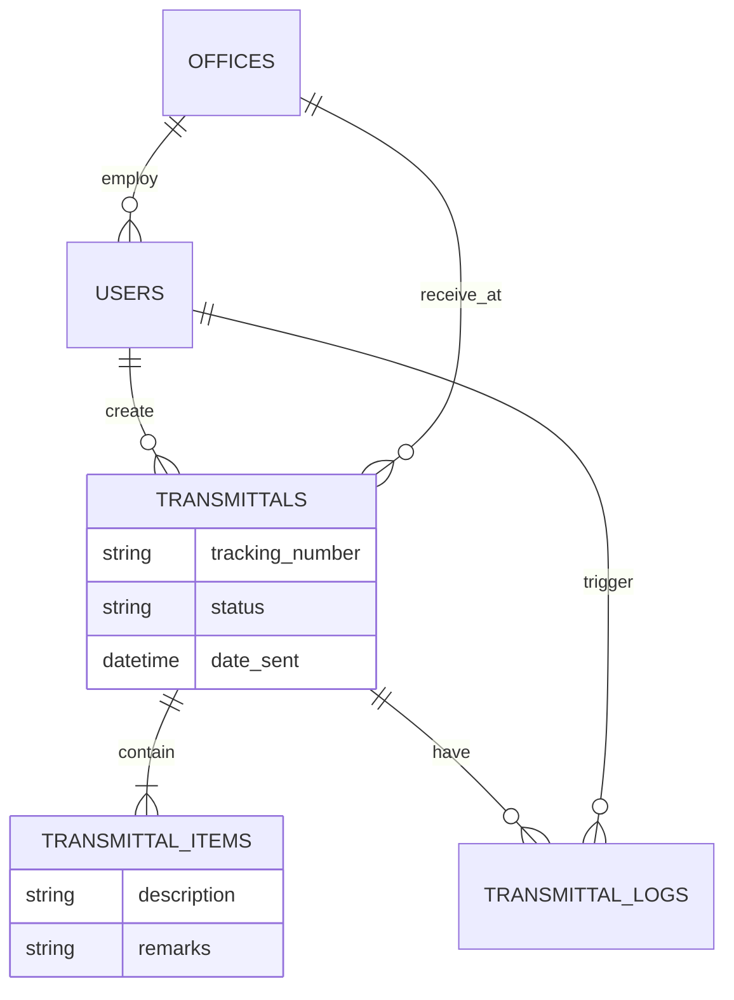

# DTI Region VI - Transmittal Management System (DTI6-TMS)

## System Development Documentation

**Prepared for:** DTI Region 6  
**Date:** January 2026  
**Version:** 1.0

---

## Table of Contents

1. [Background](#background)
2. [Objectives](#objectives)
3. [System Outputs](#system-outputs)
4. [System Components](#system-components)
5. [Core Modules](#core-modules)
6. [Technology Stack](#technology-stack)
7. [System Database Design](#system-database-design)
8. [Workflow / User Flow](#workflow--user-flow)
9. [Annexes](#annexes)

---

## Background

The **DTI6 - Transmittal Management System (DTI6-TMS)** is a modern web-based platform designed to upgrade and replace the legacy Microsoft Access-based system. It serves as the central hub for the creation, routing, tracking, and archiving of official transmittal documents across all DTI Region VI offices. By migrating to a web architecture, the system ensures real-time accessibility, improved data integrity, and seamless collaboration between provincial and regional offices.

---

## Objectives

The system aims to:

- **Modernize Document Routing**: Replace offline/local network tools with a cloud-ready web application.
- **Enhance Traceability**: Provide real-time status updates and location tracking for every physical document bundle.
- **Improve Efficiency**: Simplify data entry with an Excel-like interface for transmittal items.
- **Ensure Accountability**: Implement comprehensive audit logs (`transmittal_logs`) to record every action (create, edit, receive).
- **Secure Verification**: Utilize QR Code technology to verify the authenticity of printed transmittal sheets.
- **Data-Driven Monitoring**: Deliver insights into office performance and document throughput via dashboards.

---

## System Outputs

- **Transmittal Sheets (PDF)**: Standardized, printable forms with embedded QR codes for physical routing.
- **Audit History Logs**: Detailed history of document movements and user actions.
- **Office Analytics**: Statistical reports on transmittal volume per office.
- **Real-time Notifications**: Alerts for incoming documents or status changes.

---

## System Components

### User Roles & Access

**Super Admin (MIS/Regional Staff)**

- Full control over system configurations, users, and offices.
- Management of Roles and Permissions.
- Access to global audit logs and system-wide reports.

**Regular User (Office Staff)**

- **Transmittal Creator**: Ability to draft, finalized, and print transmittals.
- **Receiver**: Ability to mark incoming transmittals as "Received" using QR scan or manual entry.
- **Viewer**: Access to personal and office-wide transaction history.

### Organizational Structure

- **Offices**: The system categorizes users into specific DTI Offices (Regional, Provincial), ensuring that transmittals are correctly routed and strictly viewable based on authority.

---

## Core Modules

### 1. Transmittal Management

- **Creation Wizard**: Single-page form to add header details and multiple line items dynamically.
- **Receiving Module**: Dedicated interface to accept incoming transmittals, automatically updating status and logging the timestamp.
- **PDF Generation**: On-demand generation of `barryvdh/laravel-dompdf` powered documents.
- **QR Integration**: Automatic QR code generation for unique identification.

### 2. Office & User Administration

- **User Management**: CRUD operations for system accounts.
- **Office Management**: Maintenance of the list of operating units/offices.
- **Role-Based Access Control (RBAC)**: Powered by `spatie/laravel-permission` to define granular capabilities.

### 3. Dashboard & Analytics

- **Activity Overview**: Summary of pending, received, and outgoing transmittals.
- **Performance Stats**: Metrics on volume of transactions processed by each office.

### 4. Notifications & Logs

- **Audit Logs**: Immutable record of who did what and when.
- **In-App Notifications**: Alerting users of pending actions (e.g., "New Transmittal Arrival").

---

## Technology Stack

### Backend

- **Framework**: Laravel 8.x
- **Language**: PHP 7.4
- **Database**: MySQL / SQLite
- **Server**: Apache (XAMPP)

### Frontend

- **Framework**: Blade Templates
- **Styling**: Bootstrap 5 & Tailwind CSS
- **Icons**: Bootstrap Icons (Localized)
- **Scripting**: Alpine.js (Localized)
- **Asset Manager**: Laravel Mix (NPM Managed)

### Key Libraries

- **PDF Generation**: `barryvdh/laravel-dompdf`
- **QR Codes**: `chillerlan/php-qrcode`
- **Permissions**: `spatie/laravel-permission`

---

## System Database Design

### Main Tables

- **users**: System accounts linking to `offices`.
- **offices**: Definition of organizational units (e.g., "Ord - Admin", "Iloilo PO").
- **transmittals**: Header record for a document bundle (Tracking Number, Date, Status).
- **transmittal_items**: Individual line items contained within a transmittal.
- **transmittal_logs**: Historical events (e.g., "Received by User X").
- **notifications**: User alerts.
- **permissions/roles**: Access control tables.

---

## Workflow / User Flow

### 1. Transmittal Creation (Sender)

1.  User logs in and navigates to "New Transmittal".
2.  Fills in destination office and subject.
3.  Adds multiple items (Subject/Description) to the list.
4.  Saves and Prints the Transmittal (with QR Code).
5.  Physical bundle is dispatched.

### 2. Receiving Process (Receiver)

1.  Receiver gets the physical bundle.
2.  Scans QR Code or searches Tracking Number in the system.
3.  Clicks "Receive" on the specific Transmittal record.
4.  System updates status to "Received" and logs the timestamp/user.

### 3. Audit & Tracking

1.  Any user with permission can view the "Audit History".
2.  The lifecycle is displayed: Created -> sent -> Received -> Archived (optional).

---

## Annexes

### Annex 1: ER Diagram

### Annex 2: Transmittal Lifecycle

---

_End of Document_
